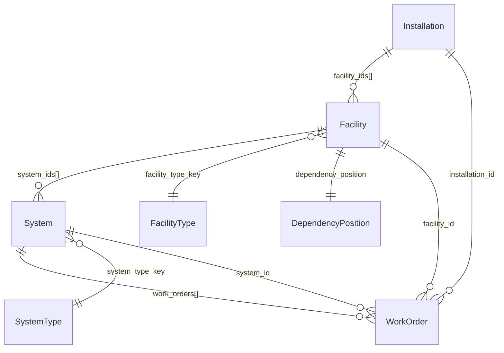

## Learned User Preferences
- Keep `README.md` and CLI-facing text aligned with the current implemented behavior and remove stale references when features change.
- Prefer concise, useful Python docstrings/comments, clear error messages, maintainable code, and no emoji.
- Prefer shorter, focused modules with one class per file where practical; grouped enums are the main exception.
- Use the repo `.venv` to run tests when available, and keep integration tests aligned with workbook-driven behavior.

---

## Application Overview

MIDAS is an Excel-configured synthetic data generation and time-stepped simulation application. It models a military infrastructure hierarchy -- Installation, Facility, System, WorkOrder -- with configurable probability distributions, dependency-chain logic, and resiliency grading. The application generates realistic maintenance work-order data and supports a Rich-based terminal dashboard for interactive time-progression simulation.

- **Language**: Python >=3.11
- **Dependencies**: numpy>=2.4.0, pandas[excel]>=2.3.3, rich>=13.7.0, scikit-learn>=1.6.0
- **Entry point**: `main.py` -> `configure_logging()` -> `run_cli()`
- **Configuration source**: `src/config/midas_config_values.xlsx` (Excel workbook with sheets for facility types, system types, installation locations, config parameters, distributions, and work-order text)

---

## Directory Layout

```
src/
  cli/
    cli.py                        # Application entry: init config, display welcome, run main menu
    simulation_shell.py           # Rich Live terminal dashboard for runtime simulation
    handlers/
      config_handlers.py          # Config viewing/reload menu actions
      simulate_handlers.py        # Generation, export, data exploration, runtime sim launch
    menu/
      menu_builder.py             # Fluent builder for MenuHandler instances
      menu_config.py              # MenuConfig dataclass (title, items, style)
      menu_factory.py             # Builds main/simulation/configuration menus
      menu_handler.py             # Menu display loop with Rich panels and Prompt.ask
      menu_item.py                # MenuItem dataclass (label, action, shortcut, flags)
    utils/
      display.py                  # DisplayHelper: Rich panels, tables, status messages
      input.py                    # InputHelper: prompts, yes/no, number input
      navigation.py               # NavigationHelper: step progress, back commands
  config/
    app_state.py                  # ApplicationState singleton, LoadResult
    display.py                    # Rich table/panel renderers for config summaries
    distributions.py              # All distribution types (probability, curve, Poisson)
    loader.py                     # Excel workbook parser -> MIDASSettings
    reference_data.py             # FacilityType, SystemType, InstallationLocation, WorkOrderText
    settings.py                   # DegradationSettings, SimulationSettings, OutputSettings,
                                  # SimulationDistributions, MIDASSettings
    functions/
      configure_logging.py        # Root logger setup, LOG_LEVEL env, quiets pandas/openpyxl
  enums/
    entity_type.py                # EntityType: INSTALLATION, FACILITY, SYSTEM
    ufc_grade.py                  # UFCGrade: G1-G4 (facility resiliency grades)
    work_order.py                 # WO_Priority, WO_TradeSkill, WO_Status
  functions/
    generate_id.py                # generate_id() -> UUID string
  models/
    dependency_position.py        # DependencyPosition value object (vertical letter + group IDs)
    facility.py                   # Facility dataclass
    installation.py               # Installation dataclass
    system.py                     # System dataclass
    work_order.py                 # WorkOrder dataclass
  simulation/
    generator.py                  # DataGenerator: thin facade over InstallGenerator
    generation_result.py          # GenerationResult: parallel-list container
    loader.py                     # SimulationDataLoader: CSV/XLSX -> GenerationResult
    data_generation/
      data_generator_base.py      # Shared sampling methods (CI, age, grade, event count)
      install_generator.py        # InstallGenerator: creates installations + delegates
      facility_generator.py       # FacilityGenerator: facilities, dependency positions, resiliency
      system_generator.py         # SystemGenerator: systems per facility type
      work_order_generator.py     # WorkOrderGenerator: work orders per system
    export/
      config.py                   # ExportConfig dataclass
      enums.py                    # OutputFormat (CSV/XLSX), OutputLayout (NORMALIZED/DENORMALIZED)
      exporter.py                 # DataExporter: generation + formatting pipeline
      transformers.py             # DataTransformer: normalized tables, denormalized rows, time series
      formatters/
        base.py                   # BaseFormatter ABC, metadata JSON writer
        csv_formatter.py          # CSVFormatter: per-table CSV files or single denormalized CSV
        excel_formatter.py        # ExcelFormatter: multi-sheet XLSX
    modules/
      base.py                     # ModuleEvent dataclass, Base ABC for tick modules
    runtime/
      clock.py                    # TickUnit, TickSize, SimulationClock
      history.py                  # ConditionIndexSnapshot, ConditionHistoryStore, ExportAdapter
      session.py                  # EntityRuntimeState, CriticalStatePausePolicy, SimulationSession
```

---

## Domain Model

### Entity Hierarchy

The domain models are plain Python dataclasses under `src/models/`. Entities reference each other via string ID fields (no ORM). The hierarchy is:

```
Installation (top)
  -> Facility (mid, has dependency_position + resiliency_grade)
    -> System (leaf, has directly-measured condition_index)
      -> WorkOrder (embedded list on System, also tracked in flat lists)
```

### Installation (`src/models/installation.py`)

| Field | Type | Default | Notes |
|-------|------|---------|-------|
| `id` | `str` | `generate_id()` | UUID |
| `title` | `str` | `""` | From InstallationLocation reference data |
| `location` | `str` | `""` | Nearest city |
| `region` | `str` | `""` | Country or state |
| `coordinates` | `str` | `""` | Lat/lon string |
| `facility_ids` | `list[str]` | `[]` | Child facility IDs |
| `condition_index` | `float \| None` | `None` | Aggregate: average of facility CIs |

### Facility (`src/models/facility.py`)

| Field | Type | Default | Notes |
|-------|------|---------|-------|
| `id` | `str` | `generate_id()` | UUID |
| `facility_type_key` | `int \| None` | `None` | FK to `FacilityType.key` in config |
| `year_constructed` | `int \| None` | `None` | |
| `dependency_position` | `DependencyPosition` | `DependencyPosition()` | Value object |
| `resiliency_grade` | `UFCGrade \| None` | `None` | G1-G4, derived from dependency tree |
| `installation_id` | `str \| None` | `None` | FK to `Installation.id` |
| `system_ids` | `list[str]` | `[]` | Child system IDs |
| `condition_index` | `float \| None` | `None` | Aggregate: average of system CIs |
| `_age_months` | `int \| None` | `None` | Runtime cache, set by `SimulationSession.sync_age_caches` |
| `_life_expectancy_months` | `int \| None` | `None` | Not currently populated at runtime |
| `_mission_criticality` | `int \| None` | `None` | Not currently populated at runtime |

Properties: `age_years` (from `_age_months` or `year_constructed`), `age_months`, `title` (resolves `FacilityType.title` via `get_app_state().settings`).

### System (`src/models/system.py`)

| Field | Type | Default | Notes |
|-------|------|---------|-------|
| `id` | `str` | `generate_id()` | UUID |
| `system_type_key` | `int \| None` | `None` | FK to `SystemType.key` in config |
| `year_constructed` | `int \| None` | `None` | |
| `condition_index` | `float \| None` | `None` | Directly sampled during generation |
| `facility_id` | `str \| None` | `None` | FK to `Facility.id` |
| `_age_months` | `int \| None` | `None` | Runtime cache |
| `_life_expectancy_months` | `int \| None` | `None` | Not currently populated at runtime |
| `work_orders` | `list[WorkOrder]` | `[]` | Embedded work order objects |

Properties: `age_years`, `age_months`.

### WorkOrder (`src/models/work_order.py`)

| Field | Type | Default | Notes |
|-------|------|---------|-------|
| `id` | `str` | `generate_id()` | UUID |
| `installation_id` | `str \| None` | `None` | FK to Installation |
| `facility_id` | `str \| None` | `None` | FK to Facility |
| `system_id` | `str \| None` | `None` | FK to System |
| `requesting_organization` | `str \| None` | `None` | Sampled from distribution (e.g. J1-J6) |
| `work_category` | `str \| None` | `None` | |
| `room_area` | `str \| None` | `None` | |
| `request_datetime` | `datetime \| None` | `None` | Sampled relative to system age/status |
| `completion_datetime` | `datetime \| None` | `None` | Only set when status is COMPLETED |
| `status` | `WO_Status \| None` | `None` | Enum: Submitted/Approved/In Progress/Completed |
| `trade` | `WO_TradeSkill \| None` | `None` | Random enum value |
| `priority` | `WO_Priority \| None` | `None` | Enum: Emergency/Urgent/Routine/Maintenance |
| `problem_description` | `str \| None` | `None` | From work_order_text_cache |
| `requested_action` | `str \| None` | `None` | From work_order_text_cache |
| `actions_taken` | `str \| None` | `None` | From work_order_text_cache |
| `impacts_mission` | `bool` | `False` | Random boolean |

### DependencyPosition (`src/models/dependency_position.py`)

A value object representing a facility's position in a dependency hierarchy.

| Field | Type | Default | Notes |
|-------|------|---------|-------|
| `vertical_position` | `str` | `"A"` | Single letter A-Z; A is top of hierarchy |
| `group_ids` | `list[int]` | `[]` | Each 1-9; shared IDs = related entities |

Format: `"{letter}{digits}"`, e.g. `"A1"`, `"B23"`. Entities at position B depend on entities at position A that share at least one group ID.

Methods: `depth` (0-based int, A=0), `has_shared_group(other)`, `is_above(other)`, `from_string(cls, str)`.

Validation in `__post_init__`: vertical_position must be A-Z, group_ids must be 1-9.

### GenerationResult (`src/simulation/generation_result.py`)

Flat container holding four parallel lists -- `installations`, `facilities`, `systems`, `work_orders` (all `list`, default empty). Class method `from_single_installation(installation, facilities, systems, work_orders)` wraps a single installation's data.

### Entity Relationship Diagram



### FK Mapping

| Source | Field | Target | Target Field |
|--------|-------|--------|-------------|
| Installation | `facility_ids[]` | Facility | `id` |
| Facility | `installation_id` | Installation | `id` |
| Facility | `facility_type_key` | FacilityType (config) | `key` |
| Facility | `system_ids[]` | System | `id` |
| System | `facility_id` | Facility | `id` |
| System | `system_type_key` | SystemType (config) | `key` |
| System | `work_orders[]` | WorkOrder | (embedded objects) |
| WorkOrder | `installation_id` | Installation | `id` |
| WorkOrder | `facility_id` | Facility | `id` |
| WorkOrder | `system_id` | System | `id` |

---

## Enums

### EntityType (`src/enums/entity_type.py`)
`INSTALLATION = "installation"`, `FACILITY = "facility"`, `SYSTEM = "system"`

### UFCGrade (`src/enums/ufc_grade.py`)
Resiliency grades per UFC 4-141-03. `G1 = "1"` (no redundancy), `G2 = "2"` (partial redundancy), `G3 = "3"` (concurrently maintainable, N+1), `G4 = "4"` (fault-tolerant, 2N). Class method `from_value(int|str)`.

### WO_Priority (`src/enums/work_order.py`)
`EMERGENCY = "Emergency"`, `URGENT = "Urgent"`, `ROUTINE = "Routine"`, `MAINTENANCE = "Maintenance"`

### WO_TradeSkill (`src/enums/work_order.py`)
`HVAC = "HVAC"`, `ELECTRICAL = "Electrical"`, `STRUCTURAL = "Structural"`, `FIRE_PROTECTION = "Fire Protection"`, `PLUMBING = "Plumbing"`

### WO_Status (`src/enums/work_order.py`)
`SUBMITTED = "Submitted"`, `APPROVED = "Approved"`, `IN_PROGRESS = "In Progress"`, `COMPLETED = "Completed"`

Open statuses (used by runtime): `{SUBMITTED, APPROVED, IN_PROGRESS}`.

### OutputFormat (`src/simulation/export/enums.py`)
`CSV = "csv"`, `XLSX = "xlsx"`

### OutputLayout (`src/simulation/export/enums.py`)
`NORMALIZED = "normalized"` (separate tables per entity), `DENORMALIZED = "denormalized"` (single flattened table, one row per work order)

### TickUnit (`src/simulation/runtime/clock.py`)
`DAY = "day"`, `WEEK = "week"`, `MONTH = "month"`, `YEAR = "year"`

---

## Configuration System

### Reference Data Types (`src/config/reference_data.py`)

All frozen dataclasses loaded from the Excel workbook:

**FacilityType**: `key: int`, `title: str`, `life_expectancy: int` (years), `mission_criticality: int` (default 1). Property: `life_expectancy_months`.

**SystemType**: `key: int`, `title: str`, `life_expectancy: int` (years), `facility_keys: tuple[int, ...]` (which facility types this system belongs to). Property: `life_expectancy_months`. Method: `belongs_to_facility(facility_key)`.

**InstallationLocation**: `title: str`, `location: str`, `region: str`, `coordinates: str`.

**WorkOrderText**: `problem_description: str`, `requested_action: str`, `action_taken: str`.

### Settings Hierarchy (`src/config/settings.py`)

**DegradationSettings** (frozen):
| Field | Type | Default |
|-------|------|---------|
| `condition_index_degraded_threshold` | `float` | `25.0` |
| `resiliency_grade_threshold` | `int` | `70` |
| `initial_condition_index` | `float` | `99.99` |
| `max_time_series_years` | `int` | `10` |

**SimulationSettings** (frozen):
| Field | Type | Default |
|-------|------|---------|
| `facilities_per_installation` | `tuple[int, int]` | `(8, 14)` |
| `dependency_chain_group_range` | `tuple[int, int]` | `(1, 3)` |
| `max_vertical_depth` | `int` | `3` |
| `maximum_system_age` | `int` | `80` |
| `maximum_facility_age` | `int` | `80` |
| `facility_condition_randomly_degrades_chance` | `int` | `35` |

Methods: `get_random_facility_count()`, `get_dependency_chain_vertical_positions()` (returns `["A".."C"]` for depth 3), `get_random_dependency_chain_vertical_position()`, `get_random_dependency_chain_group_count()`, `get_random_dependency_chain_group_IDS()`.

**OutputSettings** (frozen):
| Field | Type | Default |
|-------|------|---------|
| `excel_sheet_main` | `str` | `"Main Data"` |
| `excel_sheet_facility_ts` | `str` | `"Facility Time Series"` |
| `excel_sheet_system_ts` | `str` | `"System Time Series"` |
| `excel_sheet_metadata` | `str` | `"_metadata"` |
| `metadata_file_suffix` | `str` | `"_metadata.json"` |
| `csv_table_separator` | `str` | `"_"` |
| `excel_sheet_work_orders` | `str` | `"Work Orders"` |

**SimulationDistributions** (mutable, fills defaults in `__post_init__`):
| Field | Type | Default |
|-------|------|---------|
| `condition_index` | `ProbabilityDistribution` | 7% [1-50], 88% [50-85], 5% [85-100] |
| `age` | `ProbabilityDistribution` | 50% [20-40], 20% [10-20], 20% [41-80], 10% [0-9] |
| `grade` | `ProbabilityDistribution` | 52% "1", 32% "2", 12% "3", 4% "4" |
| `work_order_count` | `BaseDistribution` | `BathtubCurveDistribution()` (default params) |
| `work_order_status` | `ProbabilityDistribution` | 8% Submitted, 14% Approved, 26% In Progress, 52% Completed |
| `work_order_priority` | `ProbabilityDistribution` | 7% Emergency, 18% Urgent, 50% Routine, 25% Maintenance |
| `work_order_requesting_organization` | `ProbabilityDistribution` | Equal weight J1-J6 |

**MIDASSettings** (mutable, top-level container):
| Field | Type | Default |
|-------|------|---------|
| `degradation` | `DegradationSettings` | factory |
| `simulation` | `SimulationSettings` | factory |
| `output` | `OutputSettings` | factory |
| `distributions` | `SimulationDistributions` | factory |
| `facility_types` | `dict[int, FacilityType]` | `{}` |
| `system_types` | `dict[int, SystemType]` | `{}` |
| `installation_locations` | `list[InstallationLocation]` | `[]` |
| `config_workbook_path` | `Path \| None` | `None` |
| `work_order_text_cache` | `dict[str, list[tuple[str, str, str]]]` | `{}` |

Key methods: `get_facility_type(key)`, `get_system_type(key)`, `get_random_facility_type(excluded_keys)`, `get_system_types_for_facility(facility_key)`, `get_random_location()`, `get_random_work_order_requesting_organization()`, `sample_work_order_text(system_type)` (looks up by lowercased system type title, falls back to `"_fallback"` key).

Class methods: `with_defaults()`, `from_excel(path)`, `default_config_path()` (returns `src/config/midas_config_values.xlsx`).

### Excel Loader (`src/config/loader.py`)

`load_settings_from_excel(path: Path) -> MIDASSettings` parses the workbook. Sheets read:
- **Facilities**: `FacilityType` rows (key, title, life_expectancy, mission_criticality)
- **Systems**: `SystemType` rows (key, title, life_expectancy, facility_keys as comma-separated)
- **Installation Locations**: `InstallationLocation` rows
- **Config**: Parameter/Key/Setting + Value/Default columns, mapped via `PARAMETER_KEY_MAP` to build `DegradationSettings`, `SimulationSettings`, `OutputSettings`
- **Distributions**: parsed via `_parse_distribution_string` / `_parse_distribution_spec` / `_parse_weighted_category_distribution` into `SimulationDistributions`
- **Work Order Text**: per-system-type triplets (problem_description, requested_action, action_taken); loaded once into `work_order_text_cache` keyed by lowercased system-type title, with a `_fallback` key for unmatched types

### ApplicationState (`src/config/app_state.py`)

**LoadResult**: `success: bool`, `errors: list[str]`, `warnings: list[str]`, counts for facility_types/system_types/installation_locations loaded. Methods: `add_error(msg)`, `add_warning(msg)`.

**ApplicationState**: `settings: MIDASSettings`, `load_result: LoadResult`. Methods: `initialize(config_path=None)` (loads Excel, falls back to defaults on error), `with_defaults()`, `reload()`, `get_status_message()`. Properties: `initialized_successfully`, `has_warnings`, `has_errors`.

Global singleton: `get_app_state()`, `set_app_state(state)`, `reset_app_state()`.

---

## Distribution System (`src/config/distributions.py`)

### DistributionContext

Dataclass with slots: `age_years: float | None`, `life_expectancy_years: float | None`, `condition_index: float | None`, `metadata: dict`. Property `age_ratio` = `age_years / life_expectancy_years` (None if either is None or life_expectancy is 0).

### BaseDistribution (Protocol)

`sample(context: DistributionContext | None = None) -> float | str`

### ProbabilitySegment

Weighted segment. Constructor: `(percentage: int [1-100], value: str)`. The `value` is parsed as either a single int (e.g. `"42"`), an int range (e.g. `"50-85"`), or left as a literal string. `sample()` returns `random.uniform(low, high)` for ranges, `float(int_value)` for single ints, or the literal string. `percentage` is stored as int 1-100 and exposed as a 0-1 fraction via the property.

### ProbabilityDistribution

Holds `list[ProbabilitySegment]`. `select_random_segment()` uses normalized weighted sampling (total percentage is normalized to 100 if it does not sum to 100). `sample()` delegates to the selected segment's `sample()`.

### EventRateDistribution

Base class for lifecycle-aware distributions. Methods:
- `rate(context) -> float`: instantaneous event rate (abstract, raises NotImplementedError)
- `expected_events(context, horizon_years) -> float`: `rate * horizon_years`
- `sample_count(context, horizon_years) -> int`: Poisson sample with lambda = `expected_events`
- `sample(context) -> float`: returns `rate(context)` for BaseDistribution compatibility

### NormalCurveDistribution(EventRateDistribution)

Gaussian bell over age ratio. Parameters: `baseline_rate=0.1`, `amplitude=0.5`, `mean=0.5`, `stddev=0.2`. `rate = baseline_rate + amplitude * exp(-0.5 * ((age_ratio - mean) / stddev)^2)`.

### BathtubCurveDistribution(EventRateDistribution)

Three-phase hazard curve over age ratio. Parameters: `early_peak_rate=0.7`, `useful_life_rate=0.2`, `wearout_peak_rate=0.9`, `early_end_ratio=0.2`, `wearout_start_ratio=0.8`, `max_ratio=1.5`. Phases: early life (linear from early_peak to useful_life), useful life (flat), wearout (linear from useful_life to wearout_peak).

This is the default distribution for `work_order_count` -- it produces higher event rates for very new and very old systems (classic bathtub hazard pattern).

### PiecewiseCurveDistribution(EventRateDistribution)

Arbitrary piecewise linear interpolation over `list[tuple[float, float]]` points (age_ratio, rate). Requires at least 2 points. Clamps to boundary rates outside the defined range.

### create_distribution_from_spec(spec: dict)

Factory: `spec["type"]` selects `"segments"` (ProbabilityDistribution), `"normal"`, `"bathtub"`, or `"piecewise"`. Used by the Excel loader to parse distribution configuration.

### Poisson Sampling

`_sample_poisson(lam)`: Pure-Python Knuth algorithm, no numpy dependency.

---

## Data Generation Pipeline

### Overview

Generation is a top-down staged pipeline: `DataGenerator` -> `InstallGenerator` -> `FacilityGenerator` -> `SystemGenerator` -> `WorkOrderGenerator`. All generators inherit from `DataGeneratorBase`. The result is a `GenerationResult` with four flat lists.

### DataGeneratorBase (`src/simulation/data_generation/data_generator_base.py`)

Shared sampling methods used by all generators:
- `__init__(settings, seed)`: optional `random.seed(seed)` for reproducibility
- `sample_year_constructed(max_age)`: samples age from `settings.distributions.age`, caps by max_age, computes `current_year - age`
- `sample_condition_index()`: samples from `settings.distributions.condition_index`
- `sample_ufc_resiliency_grade()`: samples grade value from `settings.distributions.grade`, converts via `UFCGrade.from_value`
- `build_system_distribution_context(system, system_type)`: builds `DistributionContext` with `age_years`, `life_expectancy_years`, `condition_index`
- `sample_event_count(distribution, context, horizon_years)`: for `EventRateDistribution`, uses `sample_count` (Poisson); otherwise samples and coerces to non-negative int
- `average_condition_index(entities)`: average of non-None `condition_index` values, rounded to 2dp

### InstallGenerator (`src/simulation/data_generation/install_generator.py`)

- `generate()`: creates one Installation from a random `InstallationLocation`, draws facility count from `settings.simulation.get_random_facility_count()`, delegates to `FacilityGenerator.generate_by_count`, sets `installation.facility_ids` and `installation.condition_index` (average of facility CIs). Returns `(Installation, list[Facility], list[System], list[WorkOrder])`.
- `generate_by_count(count)`: calls `generate()` N times, merges into `GenerationResult`.

### FacilityGenerator (`src/simulation/data_generation/facility_generator.py`)

- `generate_by_count(installation_id, count)`: for each facility, picks a `facility_type_key` (prefers unused types), generates dependency positions, creates systems via `SystemGenerator`, sets `facility.condition_index` = average of system CIs, sets `work_order.installation_id` on all child work orders.
- **Dependency position generation**: random vertical position from configured depth, random group IDs from configured range. Validation (up to 10 passes): non-A positions without a supporting facility (one sharing a group ID at a lower-letter position) are demoted to position A.
- **Resiliency grade assignment**: facilities grouped by vertical level; deepest levels get `sample_ufc_resiliency_grade()`; upper levels derive grade from dependents: fraction of dependents meeting G4/G3/G2 thresholds compared to `resiliency_grade_threshold` (default 70%).

### SystemGenerator (`src/simulation/data_generation/system_generator.py`)

- `generate_by_facility(facility)`: gets all `SystemType`s for the facility's type key via `settings.get_system_types_for_facility`. Creates one `System` per required system type with sampled `year_constructed` and `condition_index`. Delegates work order generation to `WorkOrderGenerator.generate_by_system` per system.

### WorkOrderGenerator (`src/simulation/data_generation/work_order_generator.py`)

- `generate_by_system(system)`: builds `DistributionContext` from system age/life expectancy/CI. Work order count = `sample_event_count(work_order_count_distribution, context, horizon_years=max(1, system.age_years))`. For each work order:
  - Status from `work_order_status` distribution -> `WO_Status` enum
  - Priority from `work_order_priority` distribution -> `WO_Priority` enum
  - Trade: random `WO_TradeSkill` enum value
  - Requesting organization from `work_order_requesting_organization` distribution
  - Text fields from `settings.sample_work_order_text(system_type_title)` (falls back to `_fallback` cache key)
  - `request_datetime`: sampled within system's age window; open-status WOs skew toward recent dates
  - `completion_datetime`: only set for COMPLETED status
  - `impacts_mission`: random boolean

### DataGenerator (`src/simulation/generator.py`)

Thin facade: `__init__(settings, seed)`, `generate_installation() -> GenerationResult`, `generate_installations(count) -> GenerationResult`. Delegates entirely to `InstallGenerator`.

---

## Runtime Simulation

### SimulationClock (`src/simulation/runtime/clock.py`)

**TickSize** (frozen): `amount: int = 1`, `unit: TickUnit = TickUnit.DAY`. Method `advance(date) -> date` uses `timedelta` for day/week, month-aware `_add_months` for month/year. Class method `presets()`: 1 day, 1 week, 1 month, 1 year.

**SimulationClock**: `current_date: date`, `tick_size: TickSize`, `tick_index: int = 0`. `advance()` increments date by tick_size and increments tick_index. `cycle_tick_size()` rotates through presets.

### ConditionHistoryStore (`src/simulation/runtime/history.py`)

**ConditionIndexSnapshot** (frozen): `entity_id`, `entity_type: EntityType`, `date`, `tick_index`, `condition_index`, optional `installation_id`, `facility_id`, `system_id`.

**ConditionHistoryStore**: append-only `snapshots: list[ConditionIndexSnapshot]`. Methods: `record_installation`, `record_facility`, `record_system`, `record_current_state` (records all entities in the hierarchy), `latest_snapshot(entity_id)`.

**ConditionHistoryExportAdapter**: converts history into pandas DataFrames. `create_tables(installation, facilities, systems)` returns `{"installation_time_series": DataFrame, "facility_time_series": DataFrame, "system_time_series": DataFrame}`.

### Module System (`src/simulation/modules/base.py`)

**ModuleEvent** (frozen): `code: str`, `message: str`, `entity_id: str | None`, `entity_type: EntityType | None`, `should_pause: bool = False`.

**Base** (ABC): `apply(session: SimulationSession) -> list[ModuleEvent]`. Both tick-time modules and pause policies implement this interface.

### SimulationSession (`src/simulation/runtime/session.py`)

Central runtime state holder. Requires exactly one installation.

**Construction**: `from_generation_result(result, settings, installation_id, start_date, modules, pause_policies)` deep-copies a single-installation subset via `select_installation_result`, then creates the session with a `SimulationClock` starting at `start_date or date.today()`.

**Fields**:
| Field | Type | Default |
|-------|------|---------|
| `result` | `GenerationResult` | required |
| `settings` | `MIDASSettings` | required |
| `clock` | `SimulationClock` | required |
| `history` | `ConditionHistoryStore` | factory |
| `modules` | `list[Base]` | `[]` |
| `pause_policies` | `list[Base]` | `[CriticalStatePausePolicy()]` |
| `paused` | `bool` | `True` |
| `playback_delay_seconds` | `float` | `0.25` |
| `selected_facility_id` | `str \| None` | `None` |
| `selected_system_id` | `str \| None` | `None` |
| `stop_reason` | `str \| None` | `None` |
| `critical_entities` | `set[tuple[EntityType, str]]` | `set()` |

**Index maps** (rebuilt on init and after structural changes):
- `facilities_by_id: dict[str, Facility]`
- `systems_by_id: dict[str, System]`
- `systems_by_facility: dict[str, list[System]]`
- `work_orders_by_system: dict[str, list[WorkOrder]]`

**Tick loop** (`step() -> list[ModuleEvent]`):
1. Clear stop_reason
2. `clock.advance()` (increment date + tick_index)
3. `sync_age_caches()` (recompute `_age_months` for all facilities/systems from `year_constructed` vs `current_date`)
4. Run each module in `self.modules` -> collect `ModuleEvent`s
5. `recalculate_aggregates()` (facility CI = avg of child system CIs; installation CI = avg of facility CIs)
6. `history.record_current_state(...)` (snapshot all entities)
7. Run pause policies -> collect more events
8. If any event has `should_pause=True`, call `self.pause(reason=first_pause_event.message)`
9. Return all events

**EntityRuntimeState** (frozen): operational summary for one entity at the current tick.
| Field | Type |
|-------|------|
| `entity_id` | `str` |
| `entity_type` | `EntityType` |
| `condition_index` | `float \| None` |
| `degraded` | `bool` |
| `inoperable` | `bool` |
| `mission_blocked` | `bool` |
| `open_work_orders` | `int` |
| `mission_impacting_open_work_orders` | `int` |
| `child_degraded_count` | `int` |
| `child_inoperable_count` | `int` |

Property: `status_label` -> `"MISSION BLOCKED"`, `"INOPERABLE"`, `"DEGRADED"`, or `"OPERATIONAL"`.

**State computation methods**:
- `get_system_state(system_id)`: degraded if CI <= threshold, inoperable if CI <= 0, mission_blocked if inoperable AND has open mission-impacting WOs
- `get_facility_state(facility_id)`: aggregates child system states; degraded/inoperable if own CI below threshold OR any child is; mission_blocked if any child is or if inoperable with mission WOs
- `get_installation_state()`: same pattern over facility states
- `iter_runtime_states()`: all systems, then facilities, then installation

**CriticalStatePausePolicy** (extends `Base`): on each tick (after tick 0), checks `iter_runtime_states()` for inoperable or mission_blocked entities. Emits a `ModuleEvent(should_pause=True)` for entities that are newly critical (not in `session.critical_entities` from the prior evaluation). Updates `critical_entities` to the current set.

**Playback controls**: `resume()`, `pause(reason)`, `increase_speed()` / `decrease_speed()` (cycles through `[1.0, 0.5, 0.25, 0.1, 0.05]` seconds/tick), `cycle_tick_size()`.

**Selection**: `set_selected_facility(id)`, `set_selected_system(id)`, `clear_selection()`. Setting a system auto-sets the parent facility. Setting a facility clears an invalid system selection.

---

## Export System (`src/simulation/export/`)

### ExportConfig (`config.py`)

Dataclass: `file_name`, `output_format: OutputFormat`, `output_directory: Path`, `include_time_series: bool`, `layout: OutputLayout`, `generate_metadata: bool`, `description: str`. `__post_init__` normalizes string args to enums, creates `output_directory/file_name/` subdirectory. Properties: `file_path` (`{dir}/{name}.{ext}`), `metadata_path` (`{dir}/{name}_metadata.json`).

### DataTransformer (`transformers.py`)

- `create_normalized_tables(installations, facilities, systems, work_orders) -> dict[str, DataFrame | None]`: produces `installations`, `facilities`, `systems`, `work_orders` DataFrames, plus optional `facility_time_series` and `system_time_series` (synthetic exponential-decay back-calculation from current CI and year_constructed).
- `create_denormalized_rows(...)`: one dict per work order, joining all parent entity fields with `install_`/`facility_`/`system_`/`work_order_` prefixes.
- `create_nested_dict(...)`: `{"installations": [{..., "facilities": [{..., "systems": [{..., "work_orders": [...]}]}]}]}`.
- Time series math: `CI(t) = CI_0 * (1 - R)^t` where `R = 1 - (CI_current / CI_0)^(1/age_months)`. Sampling: monthly for first 24 months, quarterly 2-10 years, yearly beyond, capped by `max_time_series_years`.

### DataExporter (`exporter.py`)

- Constructor takes all export params + optional settings. Creates `ExportConfig`, `DataGenerator`, `DataTransformer`, and the appropriate formatter.
- `generate_and_export(method, target_count) -> Path`: `"default"` generates one installation; `"installations"` generates N installations; `"facilities"` generates enough installations to reach N facilities. Writes metadata + calls formatter.
- `export_existing(installations, facilities, systems, work_orders) -> Path`: exports pre-existing data without generation.

### Formatters

**BaseFormatter** (ABC): `export(installations, facilities, systems, work_orders, metadata) -> Path`, `_write_metadata(metadata)` (JSON file).

**CSVFormatter**: normalized layout writes one `{name}{separator}{table}.csv` per non-empty table; denormalized writes single CSV. Metadata JSON sidecar if enabled.

**ExcelFormatter**: normalized layout writes sheets (Installations, Facilities, Systems, Work Orders, optional time-series sheets, optional _metadata sheet); denormalized writes Main Data sheet + optional metadata.

---

## Loader (`src/simulation/loader.py`)

**SimulationDataLoader**: `__init__(settings: MIDASSettings)`, `load(dataset_path) -> GenerationResult`.

- Directory path -> `_load_csv_tables`: reads `{separator}{table}.csv` or `{table}.csv` files for required tables (`installations`, `facilities`, `systems`, `work_orders`)
- `.xlsx` file path -> `_load_excel_tables`: reads sheets by name (Installations, Facilities, Systems, work orders sheet name from `settings.output.excel_sheet_work_orders`)
- `_build_generation_result`: parses DataFrames into entity objects:
  - Installations: all string fields
  - Facilities: parses `DependencyPosition.from_string` for `dependency_chain` column, `UFCGrade.from_value` for `resiliency_grade`
  - Systems: standard field parsing
  - Work orders: parses `WO_Status`, `WO_TradeSkill`, `WO_Priority` enums, datetimes, booleans
- Wires relationships: `facility_ids` on installations, `system_ids` on facilities, `work_orders` on systems (matched by `system_id` FK)

---

## CLI and Simulation Shell

### Menu System (`src/cli/menu/`)

**MenuItem**: `label`, `action: Callable`, `exit_menu: bool`, `enabled: bool`, `visible: bool`, `separator_before: bool`, `shortcut: str | None`, `description: str | None`.

**MenuConfig**: `title`, `items: list[MenuItem]`, `border_style`, `show_shortcuts`, `auto_number`.

**MenuBuilder**: fluent builder. `add_item(...)`, `add_separator()`, `build() -> MenuHandler`.

**MenuHandler**: `display()` renders Rich panel with numbered items. `run()` loops: display, prompt for number, execute action, repeat until `exit_menu` item chosen.

### Menu Tree (`src/cli/menu/menu_factory.py`)

- **Main Menu**: "Run Time Simulation" (launches runtime sim flow), "Simulation" (submenu), "Configuration" (submenu), "Exit"
- **Simulation Submenu**: "Explore Data" (hierarchical browse), "View Facility & System" (tabular view), "Quick Generate" (recursive stats), "Generate & Export" (9-step wizard), "Back"
- **Configuration Submenu**: "View Facility Types Summary", "View System Types Summary", "View Installation Locations Summary", "View Config Values", "Reload Configuration", "Back"

### Handlers (`src/cli/handlers/`)

**config_handlers.py**: `handle_reload_configuration`, `handle_view_facility_types_summary`, `handle_view_system_types_summary`, `handle_view_installation_locations_summary`, `handle_view_config_values`.

**simulate_handlers.py**:
- `handle_run_time_simulation()`: prompts generate-or-load -> if load, accepts CSV dir or XLSX path -> `SimulationDataLoader.load()` -> selects installation -> `SimulationSession.from_generation_result()` -> `SimulationShell(session).run()`
- `handle_generate_data()`: 9-step export wizard (file name, format, layout, time series, metadata, description, method, target count, confirm) -> `DataExporter.generate_and_export()`
- `handle_view_simulated_data_examples()`: hierarchical browse installation -> facility -> system -> work orders
- `handle_quick_generate()`: generates, prints recursive stats
- `handle_view_facility_and_system()`: tabular view of facilities and systems

### SimulationShell (`src/cli/simulation_shell.py`)

Rich Live terminal dashboard for interactive simulation. Uses `_TerminalKeyReader` for raw terminal key polling (non-blocking).

**Keyboard controls**:
- `q` / `Ctrl-C`: quit
- `Space` / `p`: toggle pause/resume
- `n`: single step (advance one tick while paused)
- `+` / `-`: increase/decrease playback speed
- `t`: cycle tick size (day -> week -> month -> year)
- `f`: toggle systems visibility in dependency tree
- `h`: show help overlay
- `i`: enter inspect mode (prompts for facility/system selection)

**Dashboard panels** (built each refresh cycle):
- `build_session_summary_panel`: installation overview, date, tick, speed, condition summary
- `build_work_order_summary_panel`: WO status counts
- `build_dependency_tree`: hierarchical tree of installation -> facilities -> systems with CI, status labels, color coding
- `build_inspect_panel`: detailed view of selected facility or system
- `build_controls_panel`: keyboard shortcut reference

---

## Key Algorithms and Business Rules

### Condition Index Aggregation
- System CI: directly sampled during generation (from `condition_index` distribution, range typically 1-100)
- Facility CI: `round(mean(system.condition_index for systems if not None), 2)`
- Installation CI: `round(mean(facility.condition_index for facilities if not None), 2)`
- Recalculated every tick in `SimulationSession.recalculate_aggregates()`

### Entity Health Classification
- **Degraded**: `condition_index <= settings.degradation.condition_index_degraded_threshold` (default 25.0)
- **Inoperable**: `condition_index <= 0`
- **Mission Blocked**: inoperable AND has open mission-impacting work orders
- For facilities/installations: also true if ANY child entity is degraded/inoperable/mission_blocked (propagates up)

### Open Work Order Statuses
`{WO_Status.SUBMITTED, WO_Status.APPROVED, WO_Status.IN_PROGRESS}` -- `COMPLETED` is not open.

### Dependency Position Validation
During generation, each facility gets a random vertical position (A through max_vertical_depth letter) and random group IDs. Validation (up to 10 passes): any facility at position B or deeper that lacks a "supporting" facility (one at a higher position sharing at least one group ID) is demoted to position A. This ensures the dependency hierarchy is structurally valid.

### Resiliency Grade Assignment
Bottom-up through the dependency tree:
1. Facilities at the deepest vertical level get a randomly sampled `UFCGrade` from the `grade` distribution
2. For each upper level, a facility's grade is derived from the fraction of its dependents (facilities sharing a group ID at deeper positions) that meet grade thresholds. If >= `resiliency_grade_threshold`% (default 70%) of dependents are G4, the facility gets G4; else check G3, then G2; fallback G1.

### Work Order Count Distribution
Default is `BathtubCurveDistribution` with default parameters. Event count is sampled via Poisson process: `lambda = rate(age_ratio) * horizon_years` where `horizon_years = max(1, system.age_years)`. This produces more work orders for very new systems (early-life failures) and very old systems (wear-out), with fewer during the "useful life" period.

### Age Tracking
During runtime simulation, `_age_months` on facilities and systems is recomputed each tick via `sync_age_caches()` using `(current_date.year - year_constructed) * 12 + current_date.month - 1`, clamped to >= 0. The `age_years` and `age_months` properties prefer the cached value when available, falling back to wall-clock computation.

### Critical State Pause Policy
After each tick (excluding tick 0), the `CriticalStatePausePolicy` scans all entities via `iter_runtime_states()`. Any entity that is inoperable or mission_blocked and was NOT in the previous tick's `critical_entities` set triggers a `ModuleEvent(should_pause=True)`. The session pauses with the first such event's message as the `stop_reason`.
