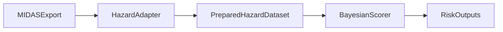
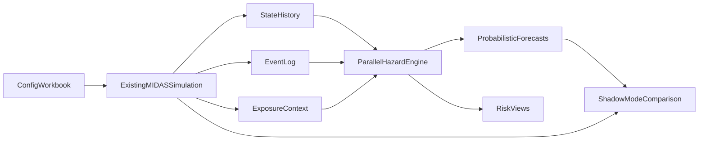

# MIDAS Hazard Integration Strategy

## Purpose

This document explains how the hazard-analysis work in this repository can be integrated with the MIDAS Alt application described in [midas_alt.md](midas_alt.md). It is meant to guide implementation, validation, and next-step decisions as the real MIDAS codebase and workbook become available.

Parts of the baseline scorer path are now implemented in `breakout/`, but the broader MIDAS integration work is still open.

Use `breakout/README.md` for module-level behavior, component roles, and code-path reference. This document is the strategy and roadmap companion to that package guide.

## Scope

- The current repository contains the hazard-analysis workflow and the MIDAS Alt specification document: [midas_alt.md](midas_alt.md).
- The actual MIDAS source code is not present here.
- MIDAS-side details in this plan are therefore design-level expectations that still need validation against the real implementation.

## Implementation Update Since Drafting

The `breakout/` package has now implemented part of the near-term scorer path described in this plan:

- normalized MIDAS bundle loading and joining via `midas_adapter.py`
- canonical `asset_registry`, `event_log`, and system-level `scoring_rows` generation from the normalized sample export
- bundle-level validation for the normalized MIDAS export shape
- a system-level baseline target for time to first critical-priority work order
- target-driven preprocessing and model wiring so grouping and feature selection are no longer hardcoded to the legacy work-order proxy

What is still not implemented:

- recurrent-event modeling for repeated work orders
- end-to-end use of a denormalized MIDAS export example from the real application
- real runtime-history export wired to `ParallelHazardEngine`
- live `EXPOSURE_CONTEXT_SCHEMA` inputs
- calibration against real-world data

What this means:

- The baseline scorer path is now partially realized against `midas/breakout-midas-data/`.
- The trajectory-engine path remains blocked on real MIDAS runtime history rather than additional scorer refactoring alone.

## Executive Summary

The current hazard-analysis workflow is a strong prototype for ranking infrastructure risk, but it is only partially aligned with the MIDAS domain model.

The clearest path forward is:

1. Use the current Weibull AFT scorer as the near-term risk-scoring layer.
2. Redefine targets around MIDAS systems rather than flat work-order rows.
3. Keep a shared canonical data contract for scorer and engine paths.
4. Build the trajectory engine in parallel, but only once MIDAS exports real runtime history.
5. Move from shadow mode to selective replacement only after the probabilistic path is trusted.

## Current State In This Repository

### Hazard Analysis Today

At a high level, the current logic:

- Loads a flat hazard-analysis CSV from [midas/midas_hazard_analysis_data.csv](midas/midas_hazard_analysis_data.csv).
- Uses `Remaining Service Life` as the survival time proxy.
- Treats `Emergency` or `Urgent` work categories as observed failures.
- Standardizes continuous features.
- Uses hierarchical random effects for `Trade` and `Installation`.
- Fits a Bayesian Weibull AFT model in PyMC.
- Produces ranked `risk_scores.csv` and `posterior_plots.png`.

In addition to that original flow, the current `breakout/` package now also supports:

- loading a normalized MIDAS export directory
- validating the normalized bundle against canonical schemas
- deriving one system-level scoring row per asset from installations, facilities, systems, and work orders
- fitting a baseline system-level scorer target based on first critical-priority work order history

### MIDAS Alt Target State

The MIDAS Alt design in [midas_alt.md](midas_alt.md) describes a very different architecture:

- Hierarchical entity model: Installation -> Facility -> System -> WorkOrder
- Time-stepped simulation
- Condition Index is directly represented at the system level
- Facility and installation condition are aggregated from children
- Work orders are generated as events related to systems
- Configuration lives in an Excel workbook
- Runtime history can be captured over ticks
- Export supports normalized and denormalized layouts
- Future degradation behavior is intended to incorporate base degradation, use-factor, major events, work orders, location, weather, and resiliency

This makes MIDAS a simulation platform with probabilistic potential, while the current hazard-analysis code is primarily a one-shot statistical scoring workflow.

## What Already Aligns

There is already real overlap between the current analysis and MIDAS:

- Both reason about age, condition, and deterioration.
- Both care about installation-level prioritization.
- MIDAS already has hierarchy, timestamps, and work orders.
- MIDAS exports are close enough to support a baseline scorer once the semantics are made explicit.

The main gaps are:

| Topic | Current hazard workflow | MIDAS needs |
| --- | --- | --- |
| Unit of analysis | Flat work-order rows | System-level snapshots and trajectories |
| Meaning of time | `Remaining Service Life` proxy | Explicit targets such as threshold crossing, inoperable state, mission-blocked state, or first critical work order |
| Meaning of failure | `Emergency` / `Urgent` work categories | Separate concepts for priority, category, degraded state, inoperable state, and mission impact |
| Role of work orders | Event labels only | Event observations plus intervention effects |
| Hierarchy | Trade and installation random effects | System type, facility type, dependency position, parent-child aggregation |
| Domain drivers | Age, CI, mission criticality, resiliency | Also use-factor, weather, location, major events, maintenance recovery |
| Data trust | Works on synthetic exports | Needs real data for calibration and operational trust |

## Integration Principles

- Separate degradation state from maintenance-event labels.
- Make the system the primary modeling unit and treat work orders as observations, consequences, or interventions.
- Define prediction targets explicitly before choosing a model family.
- Support both one-shot scoring and time-stepped forecasting.
- Preserve uncertainty rather than collapsing everything into deterministic rules too early.
- Let MIDAS configuration drive scenario behavior, but let empirical data calibrate hazard behavior whenever possible.
- Build the hazard layer so it can run in parallel with the existing simulation before replacing any part of it.

## Canonical Data Contract

The most important integration task is defining a data contract that both the existing hazard workflow and the future MIDAS application can understand.

### Canonical Tables

| Table | Grain | Key fields | Why it matters |
| --- | --- | --- | --- |
| `asset_registry` | One row per system | `installation_id`, `facility_id`, `system_id`, `facility_type_key`, `system_type_key`, `year_constructed`, `life_expectancy_years`, `mission_criticality`, `resiliency_grade`, `dependency_position`, `location`, `region`, `coordinates` | Stable identity and mostly static system characteristics |
| `asset_state_history` | One row per system per tick or observation date | `simulation_run_id`, `as_of_date`, `tick_index`, IDs, `age_months`, `condition_index`, facility and installation CI, degraded/inoperable/mission-blocked flags, open work-order counts | Main input for trajectories, threshold models, and forecasting |
| `event_log` | One row per event | `event_id`, `simulation_run_id`, `system_id`, `event_type`, `event_date`, `source`, `priority`, `status`, `trade`, `mission_impacting`, `major_event_code`, `maintenance_action`, `estimated_effect_size` | Common event layer for work orders, interventions, and shocks |
| `exposure_context` | One row per system per tick or scenario slice | `simulation_run_id`, `tick_index`, `system_id`, `base_degradation_factor`, `use_factor`, `weather_factor`, `location_factor`, `resiliency_factor`, `major_event_factor`, `maintenance_recovery_factor` | Carries planned MIDAS drivers without overloading entity tables |

### Why This Contract Matters

- The scorer path can consume snapshots from these tables.
- The engine path can consume trajectories from these tables.
- Export-time integration and runtime integration can use the same semantics.

## Integration Option 1: Post-Simulation Risk Scorer

### What It Is

This option treats the hazard model as an analysis layer that runs after MIDAS generation or after a runtime snapshot/export. It scores systems, facilities, or work-order-linked rows without changing the simulator itself.

### How It Would Work



### Best First Use Cases

- Rank systems by likely near-term operational risk
- Identify assets likely to generate urgent or emergency work orders
- Support maintenance prioritization across installations
- Compare multiple MIDAS simulation runs using one consistent scoring framework

### Strengths

- Lowest implementation risk
- Reuses the current Bayesian work most directly
- Easy to validate independently from the simulator
- Can run on historical real data and synthetic MIDAS output
- Does not require immediate replacement of existing MIDAS logic

### Limitations

- Still downstream of the simulator
- Does not directly drive CI evolution
- Can become a thin reporting layer unless its targets are defined carefully
- If trained only on synthetic output, it may simply learn the simulation's own assumptions

### Recommended First Targets For This Path

- `P(critical_work_order within 12 months | current_state)`
- `expected_time_to_degraded_threshold`
- `expected_time_to_inoperable`

### `breakout/` Changes Needed For The Scorer Path

Most of the scorer-path work falls into five buckets:

- **Ingestion and validation**: accept denormalized exports, normalized tables, and in-memory data with explicit schema/version checks.
- **Target and feature construction**: support system snapshots, multiple targets, multiple horizons, and explicit event definitions.
- **Model families**: keep Weibull AFT as the baseline, then add discrete-time, threshold, and recurrent-event alternatives.
- **Outputs and trust checks**: add horizon-specific outputs, uncertainty intervals, posterior predictive checks, calibration, and ranking-stability checks.
- **Orchestration**: support explicit modes such as `score_export`, `fit_history`, and `score_snapshot`.

The file-by-file view later in this document summarizes the same work in a shorter implementation matrix.

## Integration Option 2: Parallel Hazard Engine

### What It Is

This option creates a hazard engine that runs in parallel with the existing MIDAS simulation. Rather than only consuming finished output, it consumes state history and exposure factors while MIDAS runs, then produces probabilistic forecasts and risk trajectories.

This is the option that best fits the long-term intent of a configurable, re-runnable, scenario-driven infrastructure degradation platform.

### Recommended Operating Principle

Do not replace the existing MIDAS simulation immediately.

Instead:

1. Let MIDAS continue to run its current or planned deterministic/config-driven simulation.
2. Run the hazard engine in shadow mode against the same systems and ticks.
3. Compare results between the simulation's native degradation logic and the hazard engine's probabilistic forecasts.
4. Replace selected logic only after the hazard engine becomes trusted.

### Conceptual Architecture



### Conceptual State Evolution

One simple way to think about the future engine is:

```text
latent_health_t+1 =
    latent_health_t
    - base_degradation(type, age, life_expectancy)
    - use_factor_t
    - weather_effect_t
    - location_effect_t
    - major_event_effect_t
    - dependency_stress_t
    + maintenance_recovery_t
    + random_noise_t

condition_index_t = f(latent_health_t)

hazard_t = g(
    condition_index_t,
    age_t,
    mission_criticality_t,
    resiliency_t,
    dependency_state_t,
    open_work_orders_t
)
```

This is not a final formula. It is a design shape that matches MIDAS more naturally than the current flat AFT workflow.

### Why This Path Fits MIDAS Better

- MIDAS is fundamentally time-stepped.
- MIDAS wants configurable domain factors.
- MIDAS wants repeated simulation and scenario comparison.
- MIDAS needs intervention effects and exogenous shocks.
- MIDAS already describes runtime modules and condition history.

### Strengths

- Aligns well with the planned MIDAS architecture
- Supports repeated interventions and recurrent events
- Can model CI evolution and critical-state probabilities together
- Supports the user-stated domains directly
- Creates a path toward replacing heuristic degradation rules later

### Limitations

- More complex than the scorer path
- Requires clearer target semantics and richer data capture
- Harder to validate without real longitudinal data
- Must avoid becoming an opaque second simulator with weak calibration

## Integration Option 3: Hybrid Strategy

The best overall approach is a hybrid:

1. Implement the scorer path first for immediate value and faster validation.
2. Build the engine path in parallel using the same canonical data contract.
3. Use the scorer path on MIDAS outputs while the engine path matures.
4. Promote the engine from shadow mode to advisory mode to selective replacement.

This provides short-term utility without prematurely locking the project into the current simplifications.

## `breakout/` Adaptation Summary

The current `breakout/` package is already close to the right architectural shape. It just needs to become more explicit about contracts, targets, and model families.

| File | Current role | Needed adaptation for MIDAS |
| --- | --- | --- |
| `breakout/load_data.py` | Fixed CSV reader | Become a generic ingestion boundary for MIDAS exports, runtime snapshots, and historical tables |
| `breakout/preprocessing.py` | Flat-table feature prep | Become schema adapter + target builder + feature builder |
| `breakout/model.py` | Single Weibull AFT builder | Become a model-builder layer with multiple hazard families |
| `breakout/likelihood.py` | One Weibull likelihood | Become modular likelihood library |
| `breakout/sampling.py` | Fixed sampling settings | Support configurable sampling, PPC, and reproducible runs |
| `breakout/diagnostics.py` | Posterior summary and R-hat | Add calibration, ranking stability, and predictive checks |
| `breakout/plots.py` | Posterior coefficient plots | Add horizon forecasts, survival curves, and scenario comparisons |
| `breakout/risk.py` | Scalar ranking export | Add richer risk outputs with horizons and uncertainty |
| `breakout/run_pipeline.py` | One fixed workflow | Become an orchestration layer with scorer and engine modes |

### Proposed Logical Layers Inside `breakout/`

- ingestion layer
- schema/contract validation layer
- target-definition layer
- feature-construction layer
- model-builder layer
- fitting/sampling layer
- diagnostics layer
- risk-output layer
- scenario comparison layer

This does not require the entire package to be rewritten at once. It means future changes should be organized around these responsibilities.

## MIDAS-Side Changes Likely Required

Because the MIDAS source is not present here, these are spec-based expectations derived from [midas_alt.md](midas_alt.md).

### 1. Runtime History Needs To Be First-Class

The hazard engine will need system histories, not just a final export snapshot.

MIDAS should be able to expose:

- system CI over time
- facility and installation aggregated CI over time
- age over time
- state transitions
- open and completed work-order counts over time
- major events and other shocks over time

### 2. Mission Criticality Needs A Verified Source

The current hazard dataset has `Mission Criticality`, but the MIDAS Alt spec notes that mission criticality is not currently populated at runtime for facilities.

That means MIDAS needs an explicit rule for where mission criticality comes from:

- facility type
- system type
- facility-level override
- system-level override
- scenario-level input

Without that, one of the current hazard model's key features remains underdefined.

### 3. Resiliency Needs A System-Level Interpretation

The hazard dataset treats resiliency like a row-level feature, while MIDAS describes UFC grades at the facility level.

MIDAS needs a clear system-facing rule such as:

- inherit parent facility resiliency
- derive effective resiliency from both facility grade and dependency context
- model resiliency as a modifier on degradation, hazard, or recovery

### 4. Work-Order Semantics Need Cleanup

The current hazard CSV uses `Work Category` values like `Emergency`, `Urgent`, `Routine`, and `Preventive Maintenance`.

In MIDAS Alt:

- `priority` is clearly enumerated
- `work_category` exists as a separate field

MIDAS integration must decide:

- whether the current hazard CSV field is truly priority
- whether it should map to `work_order_priority`
- whether `work_order_category` should remain a separate semantic dimension

This matters because the current model uses that field to define the event itself.

### 5. Export Needs A Stable Hazard-Friendly Shape

The denormalized export path described in [midas_alt.md](midas_alt.md) is the right initial bridge, but it needs some additional fields for strong hazard integration.

Recommended export additions:

- stable `system_id`
- stable `facility_id`
- stable `installation_id`
- observation date or tick index
- age in months or enough data to derive it
- system CI
- facility CI
- installation CI
- mission criticality
- resiliency grade
- dependency position
- life expectancy
- scenario/config identifiers
- use-factor, weather, location, and major-event exposure summaries

## How The Planned MIDAS Domains Fit Into The Hazard Layer

The user's intended MIDAS domains map naturally into hazard modeling if they are expressed as explicit covariates or transition effects.

| MIDAS domain | Hazard-layer role |
| --- | --- |
| Base degradation | Baseline wear or drift over time |
| Use-factor | Multiplier on wear rate or critical-event intensity |
| Major event | Shock event that causes step-change damage or immediate hazard spikes |
| Work orders | Interventions, partial recovery, or event observations |
| Location | Persistent environmental modifier |
| Weather | Time-varying exposure input |
| Resiliency | Modifier on damage propagation, recovery, or failure threshold |

The most important design choice is to represent these as explicit model inputs rather than burying them in ad hoc condition updates.

## Concrete Next Steps

### Immediate Next Steps

1. Run a full end-to-end posterior fit on `midas/breakout-midas-data/`, which currently gives a normalized sample of 10 installations, 103 facilities, 2,007 systems, and 23,281 work orders.
2. Save and review the baseline artifacts from that run: validation output, posterior summary, R-hat, posterior plots, and top-ranked risk outputs.
3. Treat that run as pipeline validation, not calibration, because the current sample bundle is synthetic MIDAS output.
4. Validate the implemented normalized-bundle path against the real MIDAS repository and workbook as soon as those are available.

### Near-Term Implementation Planning Steps

1. Resolve the export semantics that still block broader use:
   - confirm whether `priority` or `work_category` is the authoritative event field
   - confirm the system-level source for mission criticality, resiliency, and life expectancy
   - confirm whether work orders only observe degradation or are also expected to change future condition
2. Produce one denormalized MIDAS export example for the scorer path and one real runtime-history export for the engine path.
3. Add the MIDAS history and export fields needed to support both paths consistently:
   - `system_id`, `tick_index`, `as_of_date`
   - age over time
   - system, facility, and installation CI over time
   - state flags and open-work-order counts
   - exposure inputs if use-factor, weather, location, major events, or maintenance recovery are meant to affect hazard
4. Keep the current Weibull AFT scorer as the baseline comparison model while adding the next candidate model path on top of the canonical `event_log`.

### Medium-Term Planning Steps

1. Add a recurrent-event model path and compare it against the current baseline scorer.
2. Add trajectory or threshold forecasting only after MIDAS exports real `SYSTEM_TRAJECTORY_SCHEMA` history.
3. Compare the normalized scorer path, denormalized scorer path, and future engine path before choosing a default MIDAS integration mode.
4. Move the engine into shadow mode before considering any replacement of existing MIDAS degradation logic.
5. Only consider selective probabilistic replacement after side-by-side validation and real-world calibration.

## Open Questions

- Where exactly do mission criticality and life expectancy live in the real implementation?
- Is the main planning unit a system, facility, or work-order-linked asset row?
- How are weather, location, and use-factor currently expected to be stored?
- Does the real export already include tick history, or only current state?
- Are work-order priority and work-order category distinct in practice?
- What parts of degradation are already deterministic, stochastic, or unimplemented?
- Which outputs do users actually need first: ranking, probability, expected time, scenario comparison, or workload forecast?
